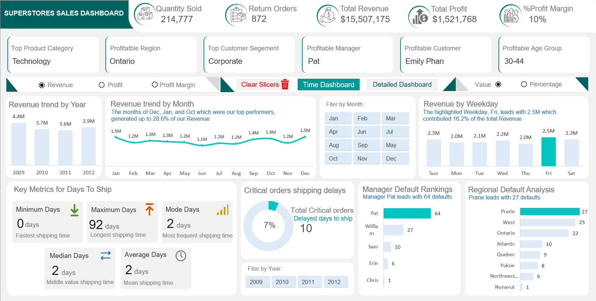

# Superstore_Sales_Analysis

## Overview

This project involves the analysis of a dataset from a superstore. The dataset contains information about sales, profits, products, customers, and geographical regions. The objective of this analysis is to gain insights into the store's performance, identify trends, and make recommendations for improvement.

## Dataset

The dataset used for this analysis is the Superstore dataset, which includes the following columns:

- Order ID: Unique identifier for each order.
- Order Date: Date the order was placed.
- Ship Date: Date the order was shipped.
- Ship Mode: Mode of shipment.
- Customer ID: Unique identifier for each customer.
- Customer Name: Name of the customer.
- Segment: Customer segment (e.g., consumer, corporate, home office).
- Region: Geographic region.
- Product ID: Unique identifier for each product.
- Category: Product category (e.g., office supplies, furniture, technology).
- Sub-Category: Sub-category of the product.
- Product Name: Name of the product.
- Sales: Total sales amount.
- Quantity: Quantity of products ordered.
- Discount: Discount applied to the order.
- Profit: Profit earned from the order.

## Data Cleaning and Preprocessing

This step involves handling missing values, removing duplicates, and converting data types if necessary. It ensures that the dataset is ready for analysis.

## Tools applied:

- Excel- the following Excel features were incorporated:
 - PivotTable(Charts,Slicers and Calculated fields); Built-in functions(Math, Logic,and LookUp functions); Page Navigation; and Enabling Macros

## Problem statement
- The monthly and yearly profit/revenue report for Sales transaction.
- Which product category, region, and customer segment is most profitable?
- What is the minimum, maximum, median, mode and mean(average) days to ship from the order date to ship date?
- How many Critical priority orders took longer to ship than the mean (average) days to ship? Which Region/Manager defaults the most based on this key performance indicator?
- The Revenue based on Weekday. Which day do we perform well the most?
- Which Age Group of customers are driving profit, and what is the commercial value (Revenue and Profit worth) of each Age Group?
- The buisness is looking to understand the drivers of returned orders. Which Product Category, Product Sub-Category, Product, Region, and Manager is this predominant to?
- How much revenue was lost due to returned products? Make some recommendation on how we can prevent this and what would be the commercial value after Six months if percentage of returns went down by 50%.

## Visualization

The report comprises 2 pages:
- Time Series Dashboard, click here
- Detailed Dashboard(Customer behavior analysis), click here

Features:
- Macro buttons are to display the data labels on the chart either as absolute values or percentages.
- Clear Slicer tab is to clear all filters after being selected on the dashboard.
- Time dashboard tab navigates to the page of Time dashboard, and vice versa for Detailed dashboard tab.

## Results and Findings

### Time Series Analysis

### Findings
- For over the four-year Preiod, 2009-2012, Year 2009 generated the most Revenue of $4,355,150M and Profit of $434,539K.
- The months, December, January, and October which where our top peformers, generated up to 28.6% of the total Revenue. While October, January, and September collectively accounted for 33.5% of the total Profit.
- The Minimum shpping time is 0 days. This means that some orders are shipped on the same day they are placed.
- The Maximum shipping time is 92 days, which suggests that a few oders experience siginificant delays.
- The Median shipping time is 2 days.
- The Mean (Average) shipping time is 2 days.
- 108 out of 1,608 orders, approximately 7%, exceeded the average shipping duration. This indicates that while the majority of Critical orders are processed within the expected timeframe, a small subset experience delays.
- Manager Pat leads the default metrics with a total of 64 defaults which represents 59.3% of his orders. This high percentage suggest that Manager Pat's area may be facing issues that need further investigation and targeted intervention.
- The Prarie region stands out as having the highest number of defaults with 27 defaults accounting for 25.0% of its orders. This indicates that the Prarie region, while not as high as Manager Pat in absolute numbers, has a considerable default rate that warrants attention.
- Friday stands out as the top performer, generating $2,516,212 in Revenue. This figure represents 16.2% of our total Revenue, making Friday the day on which we perform the best.

### Detailed Analysis

### Findings
