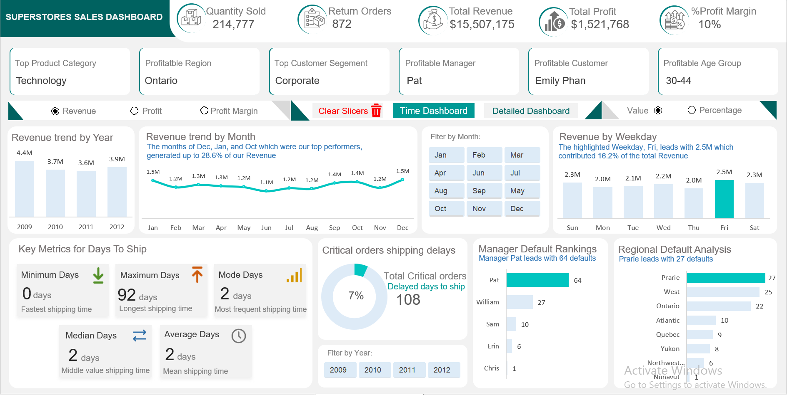

# Superstore_Sales_Analysis

## Overview

This project involves the analysis of a dataset from a Superstore. The dataset contains information about sales, profits, products, customers, and geographical regions. The objective of this analysis is to gain insights into the store's performance, identify trends, and make recommendations for improvement.

## Dataset

The dataset used for this analysis is the Superstore dataset, which includes the following columns:

- `Order_ID`: Unique identifier for each order.
- `Row_ID`: Unique identifier for each row.
- `Order_Priority`: e.g Critical, High, Medium, Low, Not specified
- `Order_Date`: Date the order was placed.
- `Ship_Date`: Date the order was shipped.
- `Ship_Mode`: Mode of shipment.
- `Shipping_Cost`: The cost incurred to ship an order.
- `Customer_ID`: Unique identifier for each customer.
- `Customer_Name`: Name of the customer.
- `Customer_segment`: e.g., consumer, corporate, home office.
- `Region`: Geographic region.
- `Product_ID`: Unique identifier for each product.
- `Product_category`: e.g., office supplies, furniture, technology.
- `Product_Sub-Category`: Sub-category of the product.
- `Product_Name`: Name of the product.
- `Unit_Price`: The cost per individual unit of the product.
- `Product_Container`: e.g, Jumbo Drum, Wrap Bag, Large Box, Medium Box, Small Box, Small Pack.
- `Product_Base_Margin`: The profit margin inherent to a product before additional costs (such as shipping or discounts) are deducted.
- `Birth_Date`: Date of birth of the customer. 
- `Sales`: Total sales amount.
- `Quantity`: Quantity of products ordered.
- `Discount`: Discount applied to the order.
- `Profit`: Profit earned from the order.
- `Status`: e.g, Returned, Delivered
- `Revenue`: Total income generated from the order.

## Data Cleaning and Preprocessing

This step involves handling missing values, removing duplicates, and converting data types if necessary. It ensures that the dataset is ready for analysis.

## Tools applied:

- Excel- the following Excel features were incorporated:
  - PivotTable(Charts,Slicers and Calculated fields)
  - Built-in functions(Math, Logic,and LookUp functions)
  - Page Navigation
  - Enabling Macros

## Problem statement
- The monthly and yearly profit/revenue report for Sales transaction.
- Which product category, region, and customer segment is most profitable?
- What is the minimum, maximum, median, mode and mean(average) days to ship from the order date to ship date?
- How many Critical priority orders took longer to ship than the mean (average) days to ship? Which Region/Manager defaults the most based on this key performance indicator?
- The Revenue based on Weekday. Which day do we perform well the most?
- Which Age Group of customers are driving profit, and what is the commercial value (Revenue and Profit worth) of each Age Group?
- The buisness is looking to understand the drivers of returned orders. Which Product Category, Product Sub-Category, Product, Region, and Manager is this predominant to?
- How much revenue was lost due to returned products? Make some recommendation on how we can prevent this and what would be the commercial value after Six months if percentage of returns went down by 50%.

## Visualization

The report comprises 2 pages:
- Time Series Dashboard, click [here](https://github.com/Mikael4success/Superstore_sales_Analysis/blob/main/timee_series_Dashboard.PNG)
- Detailed Dashboard(Customer behavior analysis), click [here](https://github.com/Mikael4success/Superstore_sales_Analysis/blob/main/Detailed_Dashboard.PNG)

Features:
- Macro buttons are to display the data labels on the chart either as absolute values or percentages.
- Clear Slicer tab is to clear all filters after being selected on the dashboard.
- Time dashboard tab navigates to the page of Time dashboard, and vice versa for Detailed dashboard tab.

## Results and Insights

### Time Series Analysis

- For over the four-year preiod, 2009-2012, Year 2009 generated the most Revenue of $4,355,150 and Profit of $434,539.
- The months, December, January, and October which where our top peformers, generated up to 28.6% of the total Revenue. While October, January, and September collectively accounted for 33.5% of the total Profit.
- The Minimum shpping time is 0 days. This means that some orders are shipped on the same day they are placed.
- The Maximum shipping time is 92 days, which suggests that a few oders experience siginificant delays.
- The Median shipping time is 2 days.
- The Mean (Average) shipping time is 2 days.
- In the shipping performance for Critical priority orders, our analysis reveals that 108 out of 1,608 orders--approximately 7%--exceeded the average shipping duration. This indicates that while the majority of Critical orders are processed within the expected timeframe, a small subset experience delays.
- Manager Pat leads the default metrics with a total of 64 defaults which represents 59.3% of his orders. This high percentage suggest that Manager Pat's area may be facing issues that need further investigation and targeted intervention.
- The Prarie region stands out as having the highest number of defaults with 27 defaults accounting for 25.0% of its orders. This indicates that the Prarie region, while not as high as Manager Pat in absolute numbers, has a considerable default rate that warrants attention.
- Friday stands out as the top performer, generating $2,516,212 in Revenue. This figure represents 16.2% of our total Revenue, making Friday the day on which we perform the best.

### Detailed Analysis

- Technology is most profitable Product Category; Ontario is the most profitable Region; and Corporate is most profitable Customer Segment.
- Delivery Truck cost the most with the lead of $51,972 Shipping Cost. $26,958 is the averag Shipping Cost across all sales transaction.
- 30-44 years is most profitable Age Group. In Revenue, 30-44 years Age Group generates $7,418,214 in total Revenue. In Profit, 30-44 years Age group leads with $781,208 in total Profit.
- The drivers of Return orders in Product Category, Office Supplies registers the highest number of returns, 461 units. While Furniture, however, shows the highest Return rate at 11.2%, indicating a higher proportion of returns relative to its sales.
- The drivers of Return orders in Product Sub-category, Paper leads with 134 Returns in volume while conversely, Book Cases have the highest Return rate at 14.3%, suggesting that even with lower absolute numbers, a larger percentage of sales ar being returned.
- The drivers of Return orders in Products, several products-- including O'Sullivan Elevations Bookcase, Cherry Finish; Bush Mission Pointe Library; Riverside Furniture Stanwyck Manor Table Series; Coloredge Poster Frame; and Imation Neon Mac format Diskettes, 10/Pack-- record the highest number of Returns(5 each). While in contrast, Products such as Avery 482; Xerox 1883; Logitech Cordless Keyboard; DIXON Oriole Pencils; and Xerox 209 all have a 100% Return rate, implying that every sale in these Product lines is being returned.
- The drivers of Return orders in Region, the Region of Ontario not only experiences the highest number of returns, 234 units but also leads in Return rate at 12.8%, signaling potential regional issues with product satisfaction or logistics.
- The drivers of Return orders in Manager, Manager Pat is associated with the highest volume of returns (234), whereas Manager William's portfolio shows the highest Return rate (11.2%).
- The total Revenue lost due to returned Products is $1,721,585 out of a total Revenue of $15,507,175--an aproximate 11.1% loss. To address this, we recommend the following strategies:
  - Improving quality control, ensure product descriptions and images accurately reflect what customers will recieve, and performing post-sale quality audits could mitigate these issues.
  - In Ontario, where both the volume and rates are highest, localized customer feedback initatives could uncover underlying issues specific to that market, leading to tailored improvements.
  - A focused investigation into specific products that exhibit extremely high rates, sometimes even reaching 100%, could reveal defects, mislabeling, mismatches, or misaligned expectations that, once corrected, would improve overall product performance.
 - The Projected commercial value after 50% reduction in returns is $2,040,995.95 over six months. This suggest that targeted reduction in returns represents a siginficant opportunity to boost short-term Revenue and improve overall financial performance.

## Conclusion and Recommendation

### Conclusion

In conclusion, this analysis provides valuable insights into the Superstore Sales operations and performance. By leveraging these insights, the Superstore Sales can make informed decisions to improve efficiency, increase sales, and enhance customer satisfaction.

### Recommendation

Based on our analysis I recommend that Manager Erin should be promoted to Head of Sales because of her scalability of success. While Erin's total Revenue and orders are smaller, her efficiency metrics, Profit Margin, 12.4%, outperforming all managers. Lowest Return rate, 8.12% meaning higher customer satisfaction and less Revenue leakage, and fewest Critical shipping dealys of 6. This suggest she can replicate this success company-wide as Head of Sales.

