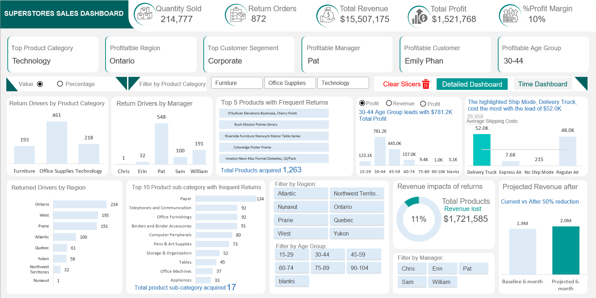

# Superstore_Sales_Analysis

## Overview

This project involves the analysis of a dataset from a superstore. The dataset contains information about sales, profits, products, customers, and geographical regions. The objective of this analysis is to gain insights into the store's performance, identify trends, and make recommendations for improvement.

## Tools applied:

- Excel- the following Excel features were incorporated:
 - PivotTable(Charts,Slicers and Calculated fields); Built-in functions(Math, Logic,and LookUp functions); Page Navigation; and Enabling Macros

## Problem statement
- The monthly and yearly profit/revenue report for Sales transaction.
- Which product category, region, and customer segment is most profitable?
- What is the minimum, maximum, median, mode and mean(average) days to ship from the order date to ship date?
- How many Critical priority orders took longer to ship than the mean (average) days to ship? Which Region/Manager defaults the most based on this key performance indicator?
- The Revenue based on Weekday. Which day do we perform well the most?
- Which Age Group of customers are driving profit, and what is the commercial value (Revenue and Profit worth) of each Age Group?
- The buisness is looking to understand the drivers of returned orders. Which Product Category, Product Sub-Category, Product, Region, and Manager is this predominant to?
- How much revenue was lost due to returned products? Make some recommendation on how we can prevent this and what would be the commercial value after Six months if percentage of returns went down by 50%.

## Visualization

The report comprises 2 pages:
- Time Series Dashboard, click here
- Detailed Dashboard(Customer behavior analysis), click here

Features:
- Macro buttons are to display the data labels on the chart either as absolute values or percentages.
- Clear SLicer tab is to clear all filters after being selected on the dashboard.
- Time dashboard tab navigates to the psge of Time dashboard, and vice versa for Detailed dashboard tab.

## Results and Findings

### Detailed Analysis

